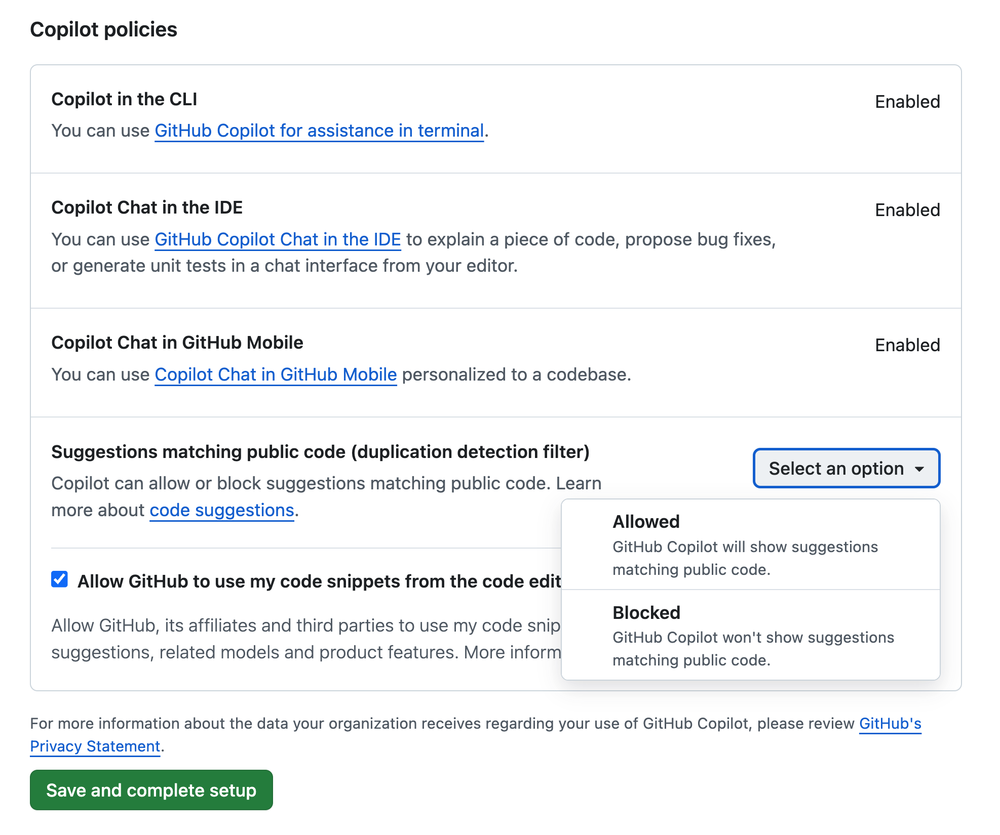
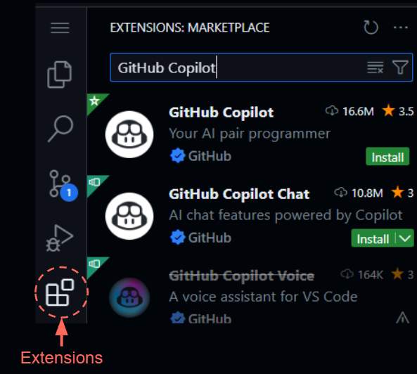

<h1>Setting up Visual Studio Code and GitHub Copilot</h1>

**Table of Contents**
- [1. GitHub Copilot](#1-github-copilot)
  - [1.1 Making a GitHub account](#11-making-a-github-account)
  - [1.1 Sign-up for Copilot](#11-sign-up-for-copilot)
- [2. Setting up Visual Studio Code](#2-setting-up-visual-studio-code)
  - [2.1 Installing Visual Studio Code](#21-installing-visual-studio-code)
  - [2.2 Setting up R in Visual Studio Code](#22-setting-up-r-in-visual-studio-code)
  - [2.2 Setting up GitHub Copilot in VS Code](#22-setting-up-github-copilot-in-vs-code)
- [3. FAQ](#3-faq)
  - [3.1 I am using windows and my VS Code can’t find R](#31-i-am-using-windows-and-my-vs-code-cant-find-r)
  - [3.2 Will I have to reinstall all my R packages in VS Code?](#32-will-i-have-to-reinstall-all-my-r-packages-in-vs-code)
  - [3.3 Where am I when I open VS Code?](#33-where-am-i-when-i-open-vs-code)
  - [3.4 I don't have a "Run Chunk" option in my R markdown file](#34-i-dont-have-a-run-chunk-option-in-my-r-markdown-file)

# 1\. GitHub Copilot

**Please sign-up for GitHub Copilot before the workshop.**

**If you are applying for free Copilot access as a student or teacher, the application is easy, however it can take a few days to process (GitHub warns it can even take _up to two weeks_, though we have not experienced this).**

In order to follow along in the workshop, you must have access to Copilot. If you are a student or teacher, you can get free access to Copilot, but you must first be verified (see [1.2 Sign-up for Copilot](#12-sign-up-for-copilot)). Otherwise, you will have to pay for a subscription, which starts at $10/month (plans available [here](https://github.com/features/copilot/plans)). If this is your first time using Copilot, you can also start a 30 day free trial. If you would like to run the workshop on your own computer (recommended) we also request that you install R and VS Code before the workshop (see [2\. Setting up VS Code](#2-setting-up-visual-studio-code)).

## 1.1 Making a GitHub account

To use GitHub Copilot you will need to create a GitHub account.

Steps:

1. Go to <https://github.com/>
2. Click Sign up
3. Sign up with your institutional email, if you have one. You can also add your institutional email later if you want to use another email (instructions [here](https://docs.github.com/en/account-and-profile/setting-up-and-managing-your-personal-account-on-github/managing-email-preferences/adding-an-email-address-to-your-github-account))
4. Follow the prompts to create your personal account. Pick your username carefully, you will likely not want to change it. Some recommendations (inspired by <https://happygitwithr.com/github-acct>):
    1. Use part of your real name so it is easier for people to know who you are
    2. Try and keep it short, you may have to type it a lot
    3. Keep everything lowercase. If you really want to separate words, use a hyphen (-) or an underscore (\_)

## 1.1 Sign-up for Copilot

GitHub Copilot *Pro* is free for verified students and teachers. Otherwise, Copilot is free with some limitations (responses are limited to 2,000 code completions and 50 chat messages per month). In today's workshop we will use the free version of Copilot. 

To get the free version of Copilot, go here and click "Get Started for Free":

<https://github.com/features/copilot>

To get Copilot *Pro* for teachers and students (for free) you need to apply for benefits here (don’t worry, it’s easy!):

<https://education.github.com/discount_requests/application>

You will need to fill out a short application which will ask you some basic information about yourself and your institution. Your institutional email must be associated with your GitHub account (instructions for adding an email to your Github account can be found [here](https://docs.github.com/en/account-and-profile/setting-up-and-managing-your-personal-account-on-github/managing-email-preferences/adding-an-email-address-to-your-github-account)). 

You will need to provide proof of your affiliation. This proof must have **your name**, **a current date,** and **the name of your institution** on it. If your application is rejected, it is most likely because your proof of affiliation was missing one of these three things (but, you can always apply again with new proof!). For example, some UC Berkeley student IDs do not have a date on them, so they will not be accepted. You may also have to follow some additional steps to verify your GitHub account, make sure to check your email for instructions. We have also heard of a bug that results in **.png files not being accepted while .jpeg files are**.

If you are a UC Berkeley student, the most straightforward way to get proof is to download a certificate of enrollment verification by going to _CalCentral > My Academics > Enrollment Verification (under Academic Records) > View or Print Enrollment via Self Service > Obtain an enrollment certificate_. This will give you a PDF enrollment certificate which you can screenshot and submit for proof of affiliation (you need to use a screenshot because the application does not accept PDFs).

If you have a problem submitting your application please submit a D-Lab consulting request here with the subject line “GitHub Co-pilot workshop: applying for student developer pack”: <https://dlab.berkeley.edu/consulting/submit-consulting-request>

Note: when you are creating a GitHub Copilot account you will be prompted to select whether GitHub can allow suggestions matching public code. You may want to select `Blocked` if you are worried about licensing and intellectual property, but for most of us it is better to select `Allowed` so we get access to more sources for our code.

# 2\. Setting up Visual Studio Code

We will be using GitHub Copilot in Visual Studio Code (VS Code), a free code editor that allows you to work with a wide variety of languages including R, Python, and many others. If you have worked with RStudio before, you will find many parts of VS Code familiar.

Visual studio has extensive documentation describing how to setup and use VS Code, which can be found here:

<https://code.visualstudio.com/docs>

We summarize the steps described in their documentation below.

## 2.1 Installing Visual Studio Code

First, install VS Code onto your computer: <https://code.visualstudio.com/download>

Detailed setup instructions can be found here:

1. Mac - <https://code.visualstudio.com/docs/setup/mac>
2. Windows - <https://code.visualstudio.com/docs/setup/windows>
3. Linux - <https://code.visualstudio.com/docs/setup/linux>

Check out this video tutorial for a brief overview of VS Code: <https://code.visualstudio.com/learn/get-started/basics>

## 2.2 Setting up GitHub Copilot in VS Code

To use GitHub Copilot in VS Code we will make use of the GitHub Copilot extension.

The instructions below are mostly copied from the original VS Code documentation which can be found here: <https://code.visualstudio.com/docs/copilot/setup>

More information about using Copilot in VS Code can be found here:

<https://code.visualstudio.com/docs/copilot/overview>

Steps:

1. Make sure you have an active GitHub Copilot subscription (see [1\. GitHub Copilot](#1-github-copilot)). VS Code will prompt you to sign-in to your GitHub account which has access to Copilot.
2. Install the GitHub Copilot extension
    1. Open VS Code
    2. Click on the Extensions icon in the toolbar on the left side
    
    

- 1. Look up “GitHub Copilot” and click the “Install” button to install Copilot. This will also automatically install “GitHub Copilot Chat”

1. Done! You will notice that a new chat bubble icon has been added to your left toolbar. Click on this button to start Copilot chat or click “Ctrl + Shift +I” to start Quick Chat and “Ctrl + I” to start in-line chat (see workshop materials or VS Code documentation for more information: <https://code.visualstudio.com/docs/copilot/getting-started>)

# 3\. FAQ

## 3.1 Where am I when I open VS Code?

When you open a new VS Code window you will see on the Welcome screen suggestions to open a file or a folder. If you open a folder (recommended), when you start running R you will be inside that folder (run **getwd()** to confirm this). If you open a file, you will be wherever your default working directory is – which is usually your user profile directory (e.g., C:\\Users\\&lt;YourUsername&gt; on windows).

